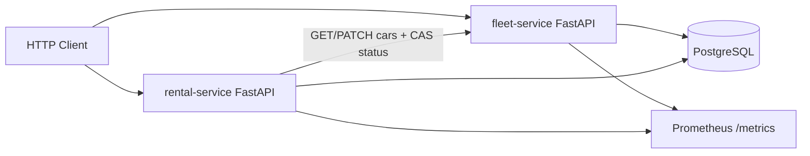

# DriveNow — Vehicle Management System

DriveNow is a microservices backend for managing a car rental fleet. It provides REST APIs for cars and rentals, persists data in PostgreSQL, and ships with Docker Compose, CI, and Kubernetes manifests.

| Service | Responsibility |
|---------|----------------|
| **fleet-service** | Cars: create, list/filter, update (including status transitions) |
| **rental-service** | Rentals: register and end; coordinates car status via fleet over HTTP |

---

## Architecture



Services emit domain events through an `EventPublisher` interface. The current deployment uses a no-op publisher; a message broker (for example RabbitMQ) and an audit store (for example MongoDB) can be added without rewriting core business logic.

### Why PostgreSQL

Cars and rentals are transactional, relational data (status rules, at most one ongoing rental per car). PostgreSQL with SQLAlchemy fits that model and runs cleanly in Compose and Kubernetes.

### Repository layout

```
drivenow/
  services/
    fleet_service/          # cars API
    rental_service/         # rentals API + fleet HTTP client
  shared/drivenow_shared/   # shared enums + DomainEvent contract
  deploy/postgres/          # Compose DB init
  k8s/                      # Kubernetes manifests
  .github/workflows/        # CI
  docker-compose.yml
```

---

## Design patterns

| Pattern | Where |
|---------|--------|
| **Repository** | `CarRepository` / `RentalRepository` — services do not use SQLAlchemy sessions directly |
| **Strategy** | `CarStatusStrategy` — explicit allowed status transitions |
| **Dependency Injection** | FastAPI `Depends` wires repositories, strategy, publisher, and fleet client |
| **Domain events + Publisher** | `EventPublisher` ABC with `NoOpEventPublisher` in the current stack |
| **Domain exceptions** | Mapped to HTTP 404 / 409 / 502 in the API layer |

Cross-service consistency:

- Rental uses **compare-and-set** on fleet status (`expected_status`) so only one register can claim an `available` car
- Partial unique index: one ongoing rental per `car_id`
- Compensation when a later step fails after a fleet or database write

---

## Data model

**fleet_db — `cars`**

| Column | Notes |
|--------|--------|
| `id` | Primary key |
| `model`, `year` | Required |
| `status` | `available` \| `in_use` \| `under_maintenance` |

**rental_db — `rentals`**

| Column | Notes |
|--------|--------|
| `id` | Primary key |
| `car_id` | Fleet car id (logical reference across services) |
| `customer_name` | Required |
| `start_date` / `end_date` | `end_date` is null while the rental is ongoing |

---

## API

Interactive docs (Swagger):

- Fleet: http://localhost:8001/docs  
- Rental: http://localhost:8002/docs  

| Method | Path | Service |
|--------|------|---------|
| `POST` | `/cars` | fleet |
| `GET` | `/cars?status=` | fleet |
| `GET` | `/cars/{id}` | fleet |
| `PATCH` | `/cars/{id}` | fleet (`status`, optional `expected_status` for CAS) |
| `POST` | `/rentals` | rental |
| `POST` | `/rentals/{id}/end` | rental |
| `GET` | `/health` | both |
| `GET` | `/metrics` | both (Prometheus) |

### Example flow

```bash
# 1) Add a car
curl -s -X POST http://localhost:8001/cars \
  -H 'Content-Type: application/json' \
  -d '{"model":"Corolla","year":2024}'

# 2) Register a rental (sets car to in_use)
curl -s -X POST http://localhost:8002/rentals \
  -H 'Content-Type: application/json' \
  -d '{"car_id":1,"customer_name":"Alice"}'

# 3) End rental (restores car to available)
curl -s -X POST http://localhost:8002/rentals/1/end

# 4) List available cars
curl -s 'http://localhost:8001/cars?status=available'
```

---

## Run with Docker Compose

Requires Docker Engine and the Compose plugin.

```bash
cd drivenow
docker compose up --build -d
docker compose ps
```

| Service | URL |
|---------|-----|
| Fleet docs | http://localhost:8001/docs |
| Rental docs | http://localhost:8002/docs |
| Postgres | `localhost:5432` (user/password `drivenow` — local defaults) |

```bash
docker compose logs -f fleet rental
docker compose down
```

---

## Run tests locally

```bash
cd drivenow
python3 -m venv .venv
source .venv/bin/activate

pip install -r services/fleet_service/requirements.txt
export PYTHONPATH="$PWD/shared:$PWD/services/fleet_service"
pytest services/fleet_service/tests -q

pip install -r services/rental_service/requirements.txt
export PYTHONPATH="$PWD/shared:$PWD/services/rental_service"
pytest services/rental_service/tests -q
```

Tests cover status transitions, rental flows, compensation, and concurrency/CAS conflicts. They do not require Postgres.

---

## CI/CD

Workflow: [`.github/workflows/ci.yml`](.github/workflows/ci.yml)

On push or pull request the pipeline:

1. Installs dependencies and runs the fleet and rental test suites  
2. Builds Docker images for both services  

---

## Kubernetes

Manifests under [`k8s/`](k8s/) deploy postgres, fleet, and rental into the `drivenow` namespace.

```bash
# Build images for a local cluster (kind / minikube)
docker build -f services/fleet_service/Dockerfile -t drivenow/fleet:latest .
docker build -f services/rental_service/Dockerfile -t drivenow/rental:latest .
# kind load docker-image drivenow/fleet:latest
# kind load docker-image drivenow/rental:latest

kubectl apply -k k8s/
kubectl -n drivenow get pods,svc
```

| Service | NodePort (typical) |
|---------|---------------------|
| Fleet | http://localhost:30001/docs |
| Rental | http://localhost:30002/docs |

Or use port-forward:

```bash
kubectl -n drivenow port-forward svc/fleet 8001:8000
kubectl -n drivenow port-forward svc/rental 8002:8000
```

Database credentials in `k8s/postgres/secret.yaml` are local defaults — replace them before deploying to a shared cluster.

---

## Logging and metrics

- **Logging:** Python `logging` to console and a rotating file under `LOG_DIR`
- **Metrics:** Prometheus gauges and histograms on `/metrics` (available cars, ongoing rentals, request latency and count)

---

## Extensibility

The `EventPublisher` seam is the extension point for async integration. A typical next step is publishing domain events to a broker and persisting an immutable audit trail in a document store, while keeping the fleet and rental service boundaries unchanged.
