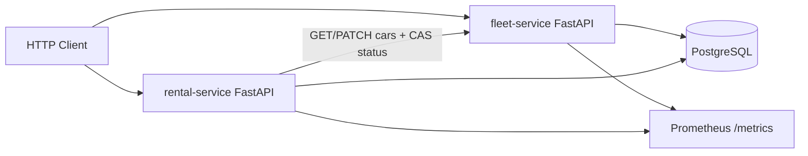

# DriveNow — Vehicle Management System

DriveNow is a microservices backend for managing a car rental fleet. It provides REST APIs for cars and rentals, persists data in PostgreSQL, and runs locally with Docker Compose.

| Service | Responsibility |
|---------|----------------|
| **fleet-service** | Cars: create, list/filter, update, delete (including status transitions) |
| **rental-service** | Rentals: register, list/filter, and end; coordinates car status via fleet over HTTP |

---

## Architecture



Services depend on an `EventPublisher` interface for domain events. The current stack uses a no-op publisher so a message-queue adapter can be plugged in later (assignment EXTRA) without rewriting business logic.

### Why PostgreSQL

Cars and rentals are transactional, relational data (status rules, at most one ongoing rental per car). PostgreSQL with SQLAlchemy fits that model and runs cleanly in Docker Compose.

### Repository layout

```
drivenow/
  services/
    fleet_service/          # cars API
    rental_service/         # rentals API + fleet HTTP client
  shared/drivenow_shared/   # shared enums + DomainEvent contract
  deploy/postgres/          # Compose DB init
  docker-compose.yml
```

---

## Design patterns

| Pattern | Where |
|---------|--------|
| **Repository** | `CarRepository` / `RentalRepository` — services do not use SQLAlchemy sessions directly |
| **Strategy** | `CarStatusStrategy` — explicit allowed status transitions |
| **Dependency Injection** | FastAPI `Depends` wires repositories, strategy, publisher, and fleet client |
| **Domain events + Publisher** | `EventPublisher` ABC with `NoOpEventPublisher` in the current stack |
| **Domain exceptions** | Mapped to HTTP 404 / 409 / 502 in the API layer |

Cross-service consistency:

- Rental uses **compare-and-set** on fleet status (`expected_status`) so only one register can claim an `available` car
- While a car is `in_use`, fleet rejects direct status changes — only rental end (CAS `in_use`→`available`) may release it
- Partial unique index: one ongoing rental per `car_id`
- Compensation when a later step fails after a fleet or database write

---

## Data model

**fleet_db — `cars`**

| Column | Notes |
|--------|--------|
| `id` | Primary key |
| `model`, `year` | Required |
| `status` | `available` \| `in_use` \| `under_maintenance` |

**rental_db — `rentals`**

| Column | Notes |
|--------|--------|
| `id` | Primary key |
| `car_id` | Fleet car id (logical reference across services) |
| `customer_name` | Required |
| `start_date` / `end_date` | `end_date` is null while the rental is ongoing |

---

## API

Interactive docs (Swagger):

- Fleet: http://localhost:8001/docs  
- Rental: http://localhost:8002/docs  

| Method | Path | Service |
|--------|------|---------|
| `POST` | `/cars` | fleet |
| `GET` | `/cars?status=` | fleet |
| `GET` | `/cars/{id}` | fleet |
| `PATCH` | `/cars/{id}` | fleet — update **details** (model/year) |
| `PATCH` | `/cars/{id}/status` | fleet — update **status** (optional `expected_status` for CAS) |
| `DELETE` | `/cars/{id}` | fleet (200 + message; 409 if car is `in_use`) |
| `POST` | `/rentals` | rental |
| `GET` | `/rentals?ongoing=` | rental (`true` = active only, `false` = ended only) |
| `POST` | `/rentals/{id}/end` | rental |
| `GET` | `/health` | both |
| `GET` | `/metrics` | both (Prometheus) |

### Example flow

```bash
# 1) Add a car
curl -s -X POST http://localhost:8001/cars \
  -H 'Content-Type: application/json' \
  -d '{"model":"Corolla","year":2024}'

# 2) Register a rental (sets car to in_use)
curl -s -X POST http://localhost:8002/rentals \
  -H 'Content-Type: application/json' \
  -d '{"car_id":1,"customer_name":"Alice"}'

# 3) List ongoing rentals (recover ids for end)
curl -s 'http://localhost:8002/rentals?ongoing=true'

# 4) End rental (restores car to available)
curl -s -X POST http://localhost:8002/rentals/1/end

# 5) List available cars
curl -s 'http://localhost:8001/cars?status=available'

# 5b) Set a car under maintenance (only when not in_use — end rental first)
curl -s -X PATCH http://localhost:8001/cars/1/status \
  -H 'Content-Type: application/json' \
  -d '{"status":"under_maintenance"}'

# 5c) Update car details (model/year)
curl -s -X PATCH http://localhost:8001/cars/1 \
  -H 'Content-Type: application/json' \
  -d '{"model":"Corolla Hybrid","year":2025}'

# 6) Delete a car (only when not in_use)
curl -s -X DELETE http://localhost:8001/cars/1
```

Mutation responses include a human-readable `message` plus the entity (`car` / `rental`). Delete returns `{"message": "Car 1 was deleted successfully."}`.

---

## Run with Docker Compose

Requires Docker Engine and the Compose plugin.

```bash
cd drivenow
docker compose up --build -d
docker compose ps
```

| Service | URL |
|---------|-----|
| Fleet docs | http://localhost:8001/docs |
| Rental docs | http://localhost:8002/docs |
| Postgres | `localhost:5432` (user/password `drivenow` — local defaults) |

```bash
docker compose logs -f fleet rental
docker compose down
```

---

## Run tests locally

```bash
cd drivenow
python3 -m venv .venv
source .venv/bin/activate

pip install -r services/fleet_service/requirements.txt
export PYTHONPATH="$PWD/shared:$PWD/services/fleet_service"
pytest services/fleet_service/tests -q

pip install -r services/rental_service/requirements.txt
export PYTHONPATH="$PWD/shared:$PWD/services/rental_service"
pytest services/rental_service/tests -q
```

Tests cover status transitions, rental flows (including list/filter), compensation, and concurrency/CAS conflicts. They do not require Postgres.

---

## Logging and metrics

- **Logging:** Python `logging` to console and a rotating file under `LOG_DIR`
- **Metrics:** Prometheus gauges and histograms on `/metrics` (available cars, active/`in_use` cars, ongoing rentals, request latency and count)
