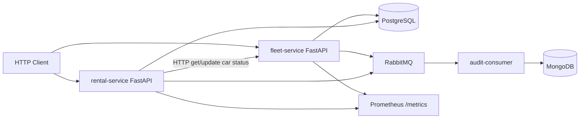

# DriveNow Vehicle Management System (Senior Showcase)

## Goal

Satisfy the **assignment** (cars/rentals, layers, logging, metrics, tests, docker-compose, README) while deliberately demonstrating skills from the **Senior Python / Microservices JD**: OOP & design patterns, Docker, CI/CD, K8s, relational + non-relational DBs, and queuing.

## Decisions (aligned to JD + assignment)

| Concern | Choice | Why |
|---------|--------|-----|
| UI | FastAPI REST (two services) | Microservices + clear API surface |
| Relational DB | **PostgreSQL** + SQLAlchemy | Strong default for transactional fleet/rental data; SQLAlchemy ORM; easy in compose/K8s |
| Non-relational DB | **MongoDB** | Audit/event history (append-only), shows polyglot persistence (JD NoSQL) |
| Queue | **RabbitMQ** | JD lists RabbitMQ; good for domain events |
| Local run | docker-compose | Assignment + Docker fluency |
| Deploy story | **Kubernetes manifests** | JD K8s requirement (local kind/minikube optional) |
| CI/CD | **GitHub Actions** | lint + pytest + image build |
| Git / GitHub | **Local by default** | Commit/push only when you ask — not after every step |

Auth, payments, and a frontend remain out of scope.

## Machine setup (you have VS Code + Python only)

**Current environment check:** Python 3.12 + `pip3` available; Docker / kubectl / local PostgreSQL **not** installed.

| Tool | Need on your PC? | Who installs it? |
|------|------------------|------------------|
| Python 3.12 + venv + pip packages | Yes | **Agent** creates venv and `pip install` during implementation |
| **Docker Engine + Compose plugin** | **Yes for Phase 1** (assignment requires `docker-compose`; Postgres runs in a container) | **You approve once** — agent can run Ubuntu install commands (`sudo` password may be required) |
| Native PostgreSQL | No | Not needed if Docker works — Postgres comes from compose |
| Kubernetes (kubectl / minikube / kind) | **No to start Phase 3** | Agent writes `k8s/` manifests; running a local cluster is optional later |
| MongoDB / RabbitMQ | No until Phase 2 | Via Docker Compose when/if Phase 2 is done |
| Git + GitHub CLI (`gh`) | Useful for push/PR | Git is usually present; `gh` optional |

**What the agent does during implementation:** project files, venv, Python deps, Dockerfiles, compose, tests, CI YAML, K8s YAML, README.

**What you must allow once for a real end-to-end run:** install Docker (and enter `sudo` password if prompted). Without Docker, we can still write all code and run **unit tests** with mocks, but we cannot bring up Postgres/API containers on your machine until Docker is installed.

**Phase 3 note:** Shipping K8s **manifests** in the repo satisfies the JD/demo story without installing a cluster on your laptop.




**Microservice boundaries**

- **fleet-service** — own cars: add, update, list (status filter), status transitions
- **rental-service** — own rentals: register, end; coordinates with fleet via sync HTTP for status, publishes async events
- **audit-consumer** — listens on RabbitMQ, writes immutable audit docs to MongoDB (car/rental lifecycle)

Phase 1 ships fleet + rental + PostgreSQL only (HTTP between services), with an `EventPublisher` **stub** (no-op) so Phase 2 can plug in RabbitMQ later without rewriting services. Phase 3 adds CI/K8s for the Phase 1 stack. **README is written after Phase 1+3 and before Phase 2**, documenting the shipped system (and noting the event-publisher stub). Phase 2 is **optional**; if done last, update compose/k8s/services **and** the README to match.

## Design patterns & OOP (call out in README)

- **Repository** — data access behind interfaces; services never touch sessions/queries directly
- **Dependency Injection** — FastAPI `Depends` + protocol/ABC interfaces (testable, SOLID)
- **Strategy** — car status transitions (`available` / `in_use` / `under_maintenance`) with explicit allowed transitions
- **Domain events + Publisher** — `EventPublisher` protocol; Phase 1 no-op or in-process; Phase 2 RabbitMQ implementation (Open/Closed)
- **Factory** — app/session factory per service
- Clear **domain exceptions** mapped to HTTP in the API layer

## Monorepo layout

```
drivenow/
  services/
    fleet_service/
      app/
        main.py
        api/
        domain/          # entities, status strategy, exceptions
        services/
        repositories/
        schemas/
        core/            # config, logging, metrics, db
      Dockerfile
      requirements.txt
    rental_service/
      app/               # same layering
      Dockerfile
      requirements.txt
    audit_consumer/      # Phase 2
      app/
      Dockerfile
      requirements.txt
  shared/                # optional small shared contracts (events, enums)
  k8s/                   # Phase 3: Deployments, Services, ConfigMaps, Secrets examples
  .github/workflows/ci.yml
  docker-compose.yml
  README.md
  tests/                 # or per-service tests/
```

## Data model

**PostgreSQL — `cars` (fleet-service)**  
`id`, `model`, `year`, `status` (`available` | `in_use` | `under_maintenance`)

**PostgreSQL — `rentals` (rental-service)**  
`id`, `car_id`, `customer_name`, `start_date`, `end_date` (nullable while ongoing)

**MongoDB — `audit_events` (Phase 2)**  
e.g. `{ event_type, entity_type, entity_id, payload, created_at }` for `car.created`, `car.status_changed`, `rental.created`, `rental.ended`

## Required operations (assignment)

| Op | Where |
|----|--------|
| Add car | `POST /cars` — fleet |
| Update car (status etc.) | `PATCH /cars/{id}` — fleet |
| List cars (+ status filter) | `GET /cars?status=` — fleet |
| Register rental | `POST /rentals` — rental (validates car via fleet, sets `in_use`) |
| End rental | `POST /rentals/{id}/end` — rental (sets end date, fleet → `available`) |

Also: `GET /health`, `GET /metrics` on each HTTP service.

## Logging & metrics

- stdlib `logging`: console + rotating file; log critical actions and errors
- `prometheus_client`: available cars, ongoing rentals, request duration histogram (per service)

## Tests

Minimum **4 unit tests** (more expected at senior level), e.g.:

1. Status Strategy rejects illegal transitions  
2. Register rental fails when car not available  
3. Register rental marks car in use (mocked fleet client / repo)  
4. End rental restores available + sets end_date  

Plus at least one API TestClient test per service.

## Phased delivery (time-boxed order)

**Do in this order when time is tight: Phase 1 → Phase 3 → README → Phase 2 (only if spare time).**

Phase 1 covers the assignment core. Phase 3 adds CI/CD and K8s. README then documents what actually ships (assignment-complete). Phase 2 is optional; if implemented, refresh **all related code and the README**.

### Phase 1 — Must have (assignment + microservices)

1. Scaffold monorepo, PostgreSQL, fleet + rental services  
2. Repositories, Strategy, DI, `EventPublisher` stub, business services  
3. REST APIs, logging, metrics  
4. Unit/API tests  
5. Dockerfiles + compose (`fleet`, `rental`, `postgres`) — demo with curl/Swagger  

### Phase 3 — Do next under time pressure (CI/CD + K8s)

1. GitHub Actions: install, pytest, Docker build for fleet/rental  
2. `k8s/` manifests for Phase 1 stack (fleet, rental, postgres)  

If Phase 2 is skipped, K8s/compose simply omit RabbitMQ, MongoDB, and audit-consumer.

### README + Git — Before Phase 2 (required for handoff)

Write `README.md` against the **current** stack (Phase 1 + Phase 3):

- Architecture diagram (mermaid)
- Why PostgreSQL (+ mention MongoDB/RabbitMQ as designed-for / stubbed via `EventPublisher`)
- Patterns used (Repository, Strategy, DI, etc.)
- How to run (compose, local)
- How to use the API (curl + `/docs`)
- CI and K8s usage notes
- Example usage
- Feature branch / public repo **only when you ask** (no automatic push each step)

This satisfies the assignment README deliverable even if Phase 2 never happens.

### Phase 2 — Optional if time (Queuing + NoSQL)

1. RabbitMQ adapter for `EventPublisher`; publish on car/rental mutations  
2. `audit_consumer` → MongoDB  
3. Extend compose + k8s: `rabbitmq`, `mongo`, `audit_consumer`  
4. **Update all related code and README** — architecture diagram, run instructions, event flow, MongoDB rationale, example audit payloads  

## Why this beats a single FastAPI monolith for this JD

A working monolith meets the assignment text; **two bounded services + PostgreSQL + Docker + CI + K8s + README** already maps to most of the JD. Adding **MongoDB + RabbitMQ** when time allows completes the polyglot + queuing story; docs stay accurate by updating the README in the same pass.
